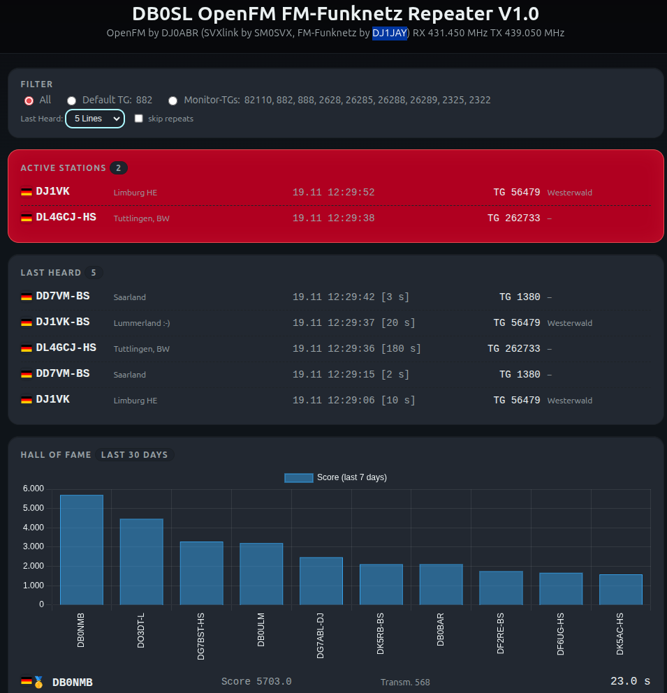
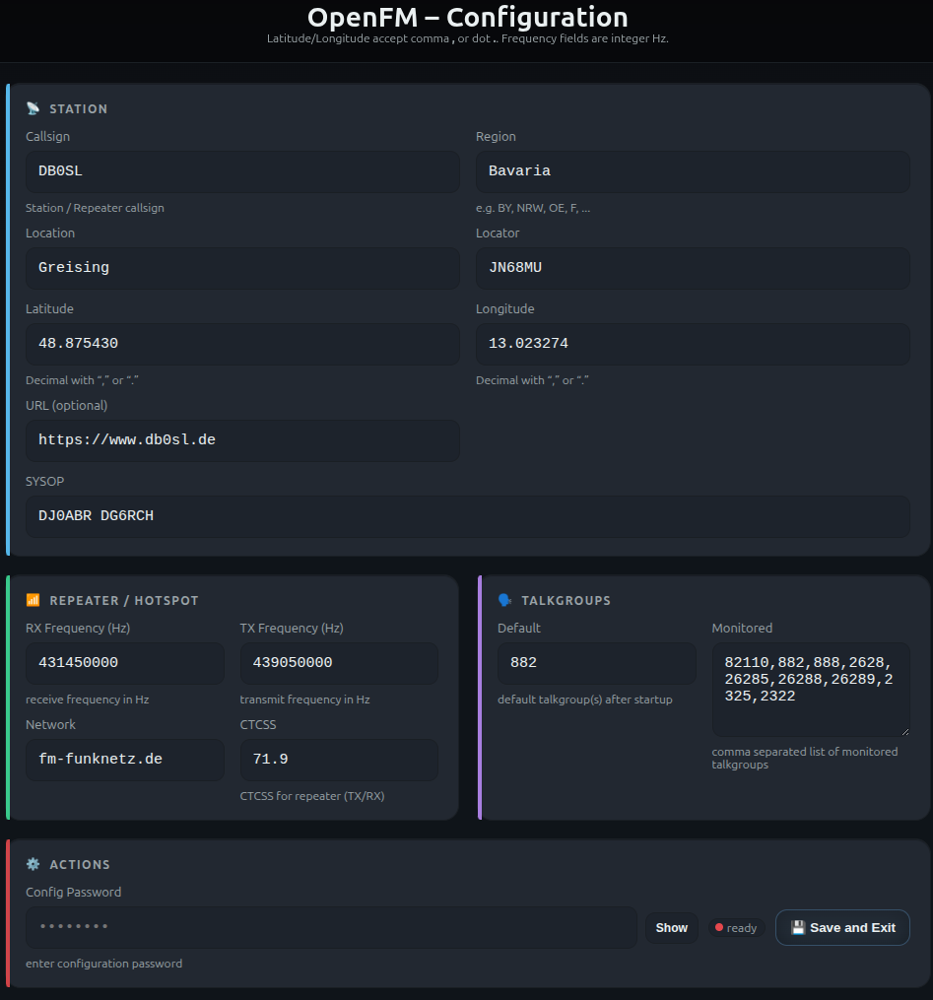

[🇬🇧 English](README.md) | [🇩🇪 Deutsch](README.de.md)

# 📡 OpenFM Repeater System

**Current Version 1.0**

Tested on: - Debian-based desktop distributions - Minimal Debian
(console only) - Debian VM on Proxmox

OpenFM is a dashboard for **SVXLink by SM0SVX** and supports the
**FM-Funknet by DJ1JAY**.

It provides a clean, OpenDVM‑compatible interface and was originally
developed for the DB0SL repeater, but it can be configured for any
station.

## Features

-   Dashboard interface for SVXLink
-   FM radio network support
-   OpenDVM‑compatible UI style
-   Talkgroup filter
-   Detailed statistics
-   Setup menu with password protection for essential configuration

------------------------------------------------------------------------

<a href="gui.png">
  
</a>

<a href="gui1.png">
  
</a>

🔗 **Live Installation:** digital.db0sl.de

## 📊 Status

Version 1.0 is approved for operation at DB0SL and should run reliably
on other repeaters as well.\
For specific hardware requirements (e.g., sound cards) minor adjustments
in `svxlink.conf` may be necessary.

## 🛠️ Installation

On a fresh Debian-based system (recommended: minimal Debian):

``` bash
sudo apt update
sudo apt install git -y
git clone https://github.com/dj0abr/OpenFM.git
cd OpenFM
```

Install the system:

``` bash
sudo ./install.sh
```

Reboot:

``` bash
sudo reboot
```

After reboot, the services **svxlink** and **fmparser** start
automatically, the database is created, and the system becomes fully
operational.

## 🌐 Web Frontend

The web interface displays all live operational data.
To access it, open the IP address of this machine in a browser on your
local network.

### 🔍 Features

-   Live status: mode, callsign, duration, talkgroup
-   Colored status tiles and country flags
-   "Last Heard" list with callsign, timestamp, duration, TG names
-   Activity chart (48h, RF / NET separated)
-   Bar statistics and 30‑day heatmap
-   Responsive dark UI
-   Uses **Chart.js** as the only external library

### 🧩 Technology

-   Pure Vanilla JavaScript
-   CSS grid layout
-   1‑second live updates via AJAX
-   Runs on any web server (nginx, Apache, lighttpd)

------------------------------------------------------------------------

## 📄 License

This project is licensed under the same terms as SVXLink.
Refer to the LICENSE file for details.
